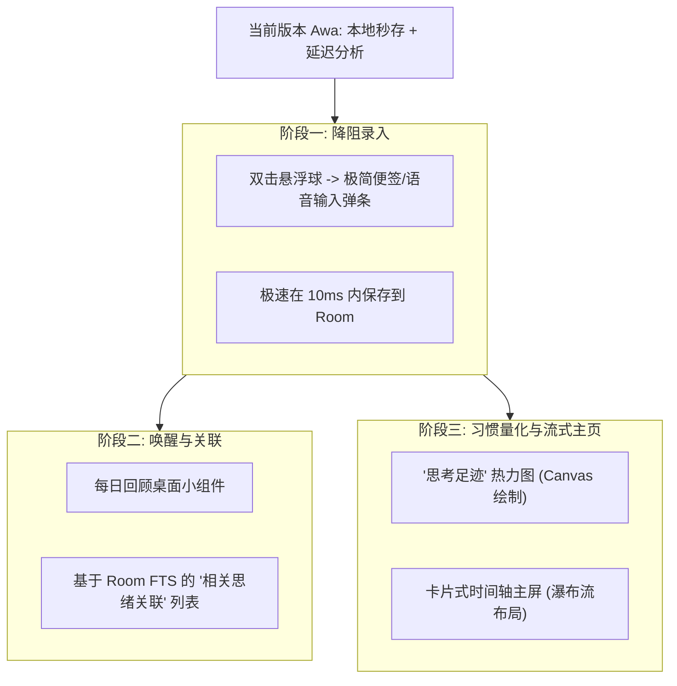

# flomo (浮墨笔记) 深度调研与 Awa Assistant 创新启示录

本调研报告旨在分析 flomo (https://help.flomo.app) 的核心笔记哲学与功能特性，并针对 Awa Assistant（我们的 AI 个人助理）提出可落地、具吸引力且契合现有架构的创新功能灵感。

---

## 1. flomo 的核心笔记哲学与精髓

flomo（浮墨笔记）的定位是 **“极简卡片笔记”**，它在繁重的 Notion 类“文档型知识库”大行其道的时代，反其道而行之：

| 特性维度 | 传统文档型笔记 (如 Notion, 印象笔记) | flomo 卡片笔记 |
| :--- | :--- | :--- |
| **输入阻力** | 高（需要建立目录、思考标题、调整排版格式） | 极低（像发微博或微信聊天一样，随时随地输入一行字） |
| **思维粒度** | 粗（以一篇文章、一个文档为单位，结构庞大） | 细（以一张卡片、一个碎片念头为单位，轻量聚焦） |
| **组织结构** | 树状目录（分类明确，但容易形成知识孤岛） | 网状标签（去中心化，通过标签与链接让知识自然生长） |
| **核心目的** | 归档与排版（偏向“存储已完成的知识”） | 思考的川流与激发灵感（偏向“捕捉与连接正在发生的想法”） |

> [!NOTE]
> **flomo 核心信条**：“连接塑造系统，而非节点塑造系统”。知识不是一堆孤立的笔记，而是通过频繁的**记录、回顾、批注与网状连接**，在大脑外部建立的“思维脚手架”。

---

## 2. 针对 Awa Assistant 的 5 大创新功能灵感

结合 Awa Assistant 现有的 **屏幕截图识别、健康卡路里记录、本地 ASR 离线语音、以及 SQLite FTS (全文检索)** 等技术底座，我们可以从 flomo 汲取以下极具杀伤力的功能灵感：

### 💡 灵感 1：升级“记忆川流”卡片式流式主屏 (Card-Stream Layout)
- **现状分析**：Awa 的“最近记录”目前是图文混排的列表。
- **优化设想**：
  - 将主页打造成一条瀑布流（Timeline Stream），每一张卡片代表一次“记忆闪存”。
  - 无论是手写便签、语音记录、屏幕截屏、还是卡路里计算，都统一转换为精美的微 white 卡片（带玻璃态发光背景与来源 Badge），以时间线方式流式排列。
  - 用户可以无缝左滑快速删除，或右滑直接“标记为已完成”。

### 💡 灵感 2：利用本地 FTS 数据库实现“相关脑洞关联” (Semantic Keyword Linking)
- **技术基础**：Awa 已经使用 SQLite 并定义了 `FtsCaptureRecord` 全文检索表。
- **优化设想**：
  - 当用户在详情页查看某条便签时，我们在后台利用 `fts_capture_records` 进行关键词匹配，在详情页底部渲染一个横向滑动区：**“💡 关联旧思绪”**。
  - 比如用户今天记录了“和张总讨论二季度计划”，详情页底部会自动关联出 7 天前截取的包含“张总”或“计划”的屏幕文本，以及半个月前的相关便签，实现跨越时间的隐性关联。

### 💡 灵感 3：桌面小组件与“灵感唤醒”卡片 (Daily Review / Random Recall)
- **核心逻辑**：对抗遗忘。很多时候，记录的价值只有在“重逢”时才会体现。
- **优化设想**：
  - **主页卡片**：在 Dashboard 顶部或侧边设计一个 **“时光胶囊” / “灵感唤醒”** 发光卡片，随机抽取 7 天前、30 天前或 1 年前的某条手拍笔记或便签，提醒用户重新审视旧念头。
  - **桌面微件 (AppWidget)**：开发一款 Android 桌面小组件，每天在桌面上随机轮播一条用户的历史便签或精彩截图总结。

### 💡 灵感 4：基于悬浮球的“无压极速录入弹窗” (Ambient Quick Capture Sheet)
- **技术基础**：Awa 拥有强大的 `FloatingOverlayService` 悬浮球系统。
- **优化设想**：
  - 既然 Awa 的定位是助理，我们就应当把输入阻力降到最低。
  - 双击悬浮球时，不再只是进行截图，而是弹出一个类似输入法的**悬浮迷你录入条 (Quick Capture Sheet)**：
    - 支持手动打字输入。
    - 提供离线 ASR 语音输入快捷麦克风。
  - 录入完成后，双击“发送”，内容在 10 毫秒内归档到本地数据库，不打断用户当前的屏幕浏览工作。这比 flomo 的桌面小工具和微信录入更加无感、迅速！

### 💡 灵感 5：Canvas 质感“思考足迹”热力图 (Activity Footprint Heatmap)
- **核心逻辑**：培养记录习惯，给用户正向反馈。
- **优化设想**：
  - 在 Dashboard 顶端或“我的”页面，绘制一个精美的、类似 GitHub 绿格子的 **“思考足迹”热力图**。
  - 用户记录便签（紫色）、截屏记录（靛蓝）、饮食卡路里（绿色）都会在格子中留下颜色点亮。随着记录的坚持，热力图会变得饱满闪耀，极大地提升用户的长期留存与记录成就感。

---

## 3. Awa 与 flomo 的结合演进路线图

我们可以将这些灵感通过一个阶段性的架构逐步推进：

> [!TIP]
> Awa Assistant 相比 flomo 的核心降维打击能力在于 **“AI 多模态的延迟分析与日程自动化”**。
> 用户在 Awa 中可以无压力地快速记录（类似 flomo），但 Awa 还能在事后一键“让 AI 帮我整理出待办日程并注册系统闹钟”。这让碎片化的卡片笔记不仅能“记录思想”，还能直接“驱动执行”。
